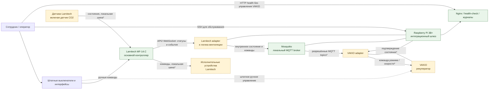

# Концептуальная схема системы «Офис»

## Назначение и границы

Документ показывает, какие узлы участвуют в офисном контуре, как между ними
передаются состояния и команды и где остаётся ручное управление. Larnitech —
единая пользовательская точка управления VAKIO; Raspberry Pi выполняет только
ограниченное преобразование API2 ↔ MQTT.

## Схема взаимодействия

`*` Физическая шина отдельных устройств Larnitech не менялась. Для VAKIO
подтверждены Base Smart, локальный MQTT и рабочие raw-команды штатного
управления; firmware/reset в интеграцию не входят.

Зелёные узлы обнаружены или подготовлены. Жёлтые узлы и пунктирные границы
требуют инвентаризации либо реализации.

## Роли узлов

| Узел | Роль | Получает | Передаёт / выполняет | Состояние |
| --- | --- | --- | --- | --- |
| Larnitech MF-14.C | Основной контроллер офисной автоматики | Состояния своих датчиков, ручные команды | Команды своим исполнительным устройствам; события через API2 | Контроллер, API2 и карта устройств проверены |
| Датчик CO2 Larnitech | Источник показаний для вентиляции | Воздух в помещении | Значение CO2 в Larnitech | CW-CO2.C, адрес `315:36`, единицы ppm |
| Raspberry Pi 3B+ | Локальный интеграционный шлюз | События Larnitech, телеметрия VAKIO | Карта, health и ограниченный мост | Работает |
| Larnitech adapter | Преобразование API2 в внутреннюю модель | События API2 WebSocket | Показания и allowlist-команды VAKIO | Работает |
| Логика вентиляции | Безопасное принятие решений | CO2, свежесть данных, режим и доступность связей | Желаемое состояние VAKIO | Запланирована; должна иметь гистерезис и временные ограничения |
| Mosquitto | Локальная доставка сообщений | Состояния и команды только авторизованных клиентов | MQTT-сообщения по ACL | Работает; LAN-доступ разрешён только VAKIO |
| VAKIO adapter | Перевод allowlist-команды в протокол Base Smart | Адрес Larnitech и свежая телеметрия | Raw-команда и обратная синхронизация | Работает |
| VAKIO Base Smart | Исполнитель вентиляции | Штатное ручное управление и локальные MQTT-команды | Состояние, режим и скорость | Подключён; выключение не даёт свежего `state=off` |
| Nginx и health-check | Диагностика без управления | Состояние gateway и системные метрики | `/healthz`, журналы и локальные проверки | Работают |

## Как проходит автоматическая команда

1. Датчик CO2 передаёт показание контроллеру Larnitech штатным способом.
2. Larnitech публикует изменение подписанному локальному клиенту через API2
   WebSocket.
3. Адаптер на Raspberry Pi проверяет время обновления и приводит показание к
   внутреннему формату.
4. Логика вентиляции учитывает два порога CO2, минимальное время работы и паузы,
   текущий режим и доступность всех связей.
5. При разрешённой автоматике команда публикуется в локальный Mosquitto только
   в allowlist топиков VAKIO.
6. VAKIO adapter отправляет команду конкретному рекуператору и ожидает обратное
   состояние. Отсутствие подтверждения считается ошибкой, а не успехом.

Получение данных Larnitech по этому потоку уже работает: gateway держит
постоянное WebSocket-соединение и подписки на CO2 `315:36` и кондиционер
`456:249`. Бинарное событие AC уточняется запросом подробного статуса. Логика
управления по CO2 ещё не включена. Ручное управление выполняется через область
`VAKIO` в Larnitech; прямой HTTP endpoint шлюза при активном мосте запрещён.

## Контуры управления

- **Ручной контур Larnitech:** штатные выключатели и интерфейсы управляют
  Larnitech независимо от Raspberry Pi.
- **Ручной контур VAKIO:** штатный способ управления должен сохраняться. Его
  совместимость со сторонним MQTT необходимо проверить для конкретной модели.
- **Автоматический контур:** Raspberry Pi может влиять только на явно
  разрешённые функции вентиляции. Произвольный `status-set` в Larnitech и
  управление критичными устройствами в этот контур не входят.
- **Сервисный контур:** оператор обслуживает Raspberry Pi по SSH и смотрит
  health endpoint. HTTP health не предназначен для передачи команд.
- **Удалённый контур:** прямой доступ из интернета не предусмотрен. Если он
  понадобится, он должен идти через отдельно спроектированный VPN или штатный
  защищённый механизм.

## Безопасное поведение

- При потере Larnitech API2, MQTT, VAKIO или при устаревшем показании CO2 новые
  автоматические команды не отправляются; автоматика переходит в `degraded`.
- После перезапуска шлюз сначала перечитывает актуальные состояния и не
  повторяет последнюю команду вслепую.
- Ручное управление остаётся доступным при отказе Raspberry Pi, MQTT или сети.
- Команды должны быть идемпотентными, ограниченными по частоте и подтверждаться
  обратным состоянием.
- API-ключи, MQTT credentials и точные идентификаторы устройств хранятся вне
  Git; брокер не публикуется в интернет.
- Управление замками, охраной, водой, газом и другими критичными системами не
  входит в эту интеграцию.

## Что нужно подтвердить перед вводом в эксплуатацию

1. Фактическую карту датчиков, выключателей и исполнительных устройств
   Larnitech, включая адрес и единицы показания CO2.
2. Фактическое вращение вентилятора после команд и поведение конкретной версии
   прошивки при выключении.
3. Совместимость локального MQTT со штатным ручным управлением VAKIO при
   длительной эксплуатации.
4. Пороговые значения CO2, скорость, гистерезис, задержки и максимальное время
   непрерывного проветривания.
5. Поведение при холодной наружной температуре, пожарном или охранном событии и
   ручном изменении режима.
6. Ethernet и резервное питание Raspberry Pi для постоянной эксплуатации.

Связанные документы: [RFC интеграции](../rfc/larnitech-vakio-raspberry-pi.md),
[спецификация Raspberry Pi](../specs/raspberry-pi-gateway.md) и
[доступ к Larnitech MF-14.C](../specs/office-larnitech-mf14c-access.md).
